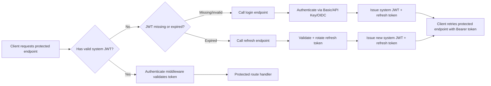
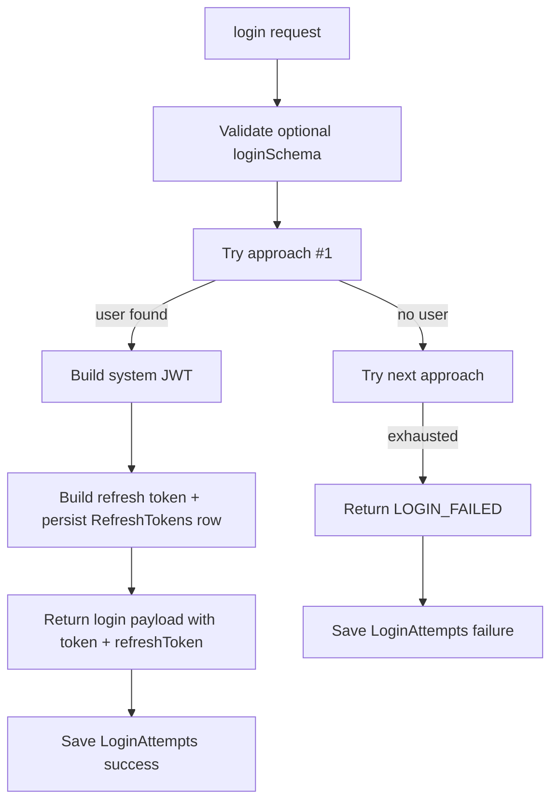
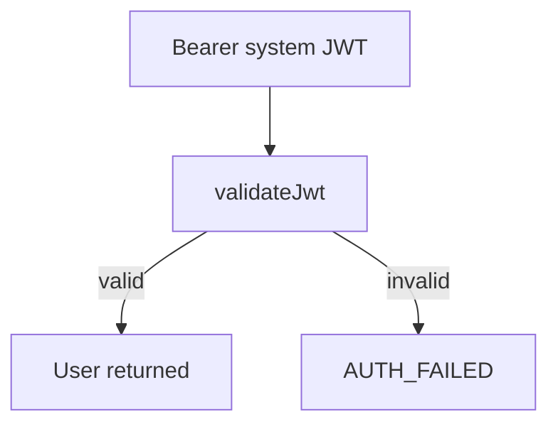
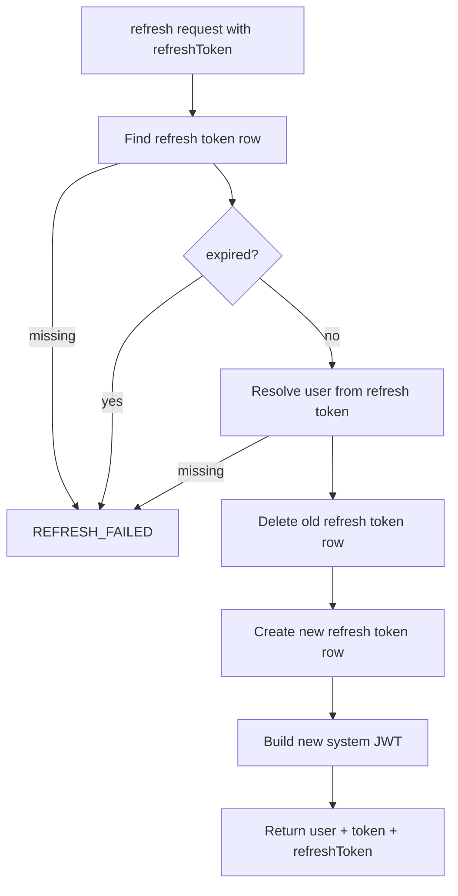

# Node in Layers Auth - an Official Node in Layers Package


[](https://coveralls.io/github/Node-In-Layers/auth?branch=main)


Drop in, fully featured, Authentication and Authorization library for Node In Layers Systems.

This package contains common authentication and authorization types, models and routines. This includes important system building models such as users and organizations as well as resuable and extensible logic for doing authentication and authorization on features and model functions.

# Big System Features

- Ability to login a User with basic auth, OIDC, or Api Keys.
- Ability to have protected / unprotected routes for REST and MCP servers
- Treeshakeable Functionality, for backend / frontend uses
- Control who can access a feature
- Control who can access a model, any specific method on that model, and even the individual rows themselves.

## QUICK: How To Use

```bash
1. Install
npm install @node-in-layers/auth
```

2. Configure Your Existing Node-in-Layers system.

```typescript
import { CoreNamespace } from '@node-in-layers/core'
import { DataNamespace } from '@node-in-layers/data'
import { AuthNamespace, LoginApproachServiceName } from '@node-in-layers/auth'

const config = {
  [CoreNamespace.root]: {
    apps: [
      await import('@node-in-layers/data/index.js'),

      // Add "Transport" Layer (rest-api or mcp-server)
      await import('@node-in-layers/rest-api/index.js'),
      //await import('@node-in-layers/mcp-server/index.js'),

      await import('@node-in-layers/auth/core/index.js'), // core models + core services/features
      await import('@node-in-layers/auth/api/index.js'), // login/authenticate + transport auth wiring
    ],
    layerOrder: ['services', 'features', 'express'], // or ['services', 'features', 'mcp']
    modelFactory: '@node-in-layers/data',
    modelCruds: true,
  },
  // ...
  // Core Configurations
  [AuthNamespace.Core]: {
    systemLevelPolicies: [],
    allowPasswordAuthentication: true,
  },

  // API Configurations (ONLY for backend APIS)
  [AuthNamespace.Api]: {
    // Select 1 or more login approaches.
    loginApproaches: [
      LoginApproachServiceName.ApiKeyAuthLogin,
      LoginApproachServiceName.BasicAuthLogin,
      LoginApproachServiceName.OidcAuthLogin,
    ],
    passwordHashSecretKey: process.env.PASSWORD_HASH_SECRET_KEY!,
    jwtSecret: process.env.AUTH_JWT_SECRET!,
    jwtIssuer: 'my-system',
    jwtAudience: 'my-system-clients',
    jwtExpiresInSeconds: 3600,
    refreshTokens: {
      ttlDays: 30,
      expiresInMinutes: 600,
      cleanupBatchSize: 500,
      cleanupMaxQueries: 20,
    },
    // OIDC/JWKS verification inputs (when using OIDC login):
    jwksUris: ['https://your-provider/.well-known/jwks.json'],
    // Optional transport route overrides:
    // loginPath: '/login',
    // loginMethod: 'POST',
    // refreshPath: '/token/refresh',
    // refreshMethod: 'POST',
  },
}
```

## At A Glance

- Provides core auth models (`Users`, `ApiKeys`, `UserAuthIdentities`, `LoginAttempts`, org/policy models).
- Provides backend auth features: `login()`, `authenticate()`, `refresh()`, and `cleanupRefreshTokens()`.
- Supports multiple login approaches out of the box: Basic Auth, API Key, and OIDC.
- Issues a system JWT + refresh token after successful login, validates JWT on protected requests, and supports token refresh/rotation.
- Works with both REST API and MCP transports.
- Supports custom user models via `AuthNamespace.Core.userModel`.

# Core Feature Implementations

## User

A user model respresents a single user of the system.

They always have full control over their own model, and the only other users that can "write" to their user are system admins.

There are aspects to the user that are public read to users within the system, which is controlled by the configuration of this package.

```typescript
type User = Readonly<{
  email: string
  firstName: string
  lastName: string
  /**
   * Is this "person" a non-person entity? If so, the organization id that this non-person entity is part of, is placed here.
   * This adds the ability for your system to support having "systems" as a user. This is completely optional, and your system
   * can just make system-system connections using an actual user's credentials.
   * If there is a value here, these non-person entities, should not show up in normal user queries.
   */
  npeOrganization?: boolean
}>
```

## Organization

An organization is a non-person entity that is managed by users.
An organization can own data that users can then manipulate based on attribute policies (see below).

```typescript
export type Organization = Readonly<{
  id: PrimaryKey
  name: string
  /**
   * The owner of the organization, (not in reality, just in terms of the user)
   */
  ownerUserId: PrimaryKey
}>
```

### OrganizationAdmins

This model says explicitly who are the admins of an organization. By default the person who creates an organization is automatically made an admin as well as the owner. No admin can remove themselves of being an admin of an organization, and only an owner (or system admin) can transfer ownership of the organization to someone else.

```typescript
type OrganizationAdmins = Readonly<{
  id: PrimaryKey
  organizationId?: PrimaryKey
  userId: PrimaryKey
}>
```

NOTE: An organizationId of null/undefined is a SYSTEM level admin. These can only be created by a system level admin.

### OrganizationAttributes

This model holds key:value pairs for a user with an organization. This is a more expressive representation of a "role" concept, but could expand to multiple different kinds of attributes.

These attributes are created/managed by admins of an organization.

NOTE: An organizationId of null/undefined is a SYSTEM attribute. These can only be created by a system level admin.

```typescript
type OrganizationAttributes = Readonly<{
  id: PrimaryKey
  organizationId?: PrimaryKey
  userId: PrimaryKey
  key: string
  value: string
}>
```

### OrganizationReferenceProperty

This property for a model adds a Foreign Key to an organization. This is a critical property that should be used throughout a system to control organization level access. All data that is associated with an organization should have this property. If it doesn't have this, then it is assumed that the data is system level, rather than user data.

In addition to just providing a number/string as a foreign key, it includes metadata in the PropertyConfig that is used by authorization code to decide if a user should have access to the data.

```typescript
type OrganizationReferenceProperty = Readonly<{
  /**
   * Defaults to "organizationId"
   */
  propertyKey?: string
}>
```

## Auth Config Reference

### `AuthNamespace.Core`

```typescript
{
  // Required by policy features.
  systemLevelPolicies: readonly Policy[]

  // When true, Users require passwordHash and basic auth is usable.
  allowPasswordAuthentication?: boolean

  // Optional replacement for default Users model.
  // Format: "domain.PluralModelName"
  userModel?: string

  // Optional property overrides for default Users model.
  userPropertyOverrides?: Record<string, PropertyConfig<any>>
}
```

### `AuthNamespace.Api`

```typescript
{
  // Ordered fallback chain. First approach that resolves a user wins.
  loginApproaches: ReadonlyArray<LoginApproachServiceName | string>

  // Optional schema validation for login request payloads.
  loginPropsSchema?: ZodType<JsonObj>

  // If true, bypasses auth middleware (use with caution).
  skipAllAuthentication?: boolean

  // Defaults: ['email', 'username']
  basicAuthIdentifiers?: ReadonlyArray<'email' | 'username'>

  // Optional OIDC payload parser override (defaults use iss/sub claims).
  parseOidcPayloadIdentifiers?: (payload: JsonObj) => { iss?: string; sub?: string }

  // Required for password hashing/verification when basic auth is enabled.
  passwordHashSecretKey?: string

  // Login audit behavior.
  noSaveLoginAttempts?: boolean

  // System JWT settings for issued tokens.
  jwtSecret?: string
  jwtIssuer?: string
  jwtAudience?: string
  jwtExpiresInSeconds?: number
  jwtAlgorithms?: readonly string[]

  // Refresh token issuance + cleanup controls.
  refreshTokens?: {
    // Retention period after expiration for cleanup purposes.
    // default: 30
    ttlDays?: number
    // Lifetime of newly issued refresh tokens.
    // default: 600
    expiresInMinutes?: number
    // Max deletes per cleanup query.
    // default: 500
    cleanupBatchSize?: number
    // Max cleanup queries per cleanup call.
    // default: 20
    cleanupMaxQueries?: number
  }

  // Used for OIDC provider token verification.
  jwksUris?: readonly string[]

  // Transport endpoint overrides.
  loginPath?: string // default '/login'
  loginMethod?: string // default 'POST'
  refreshPath?: string // default '/token/refresh'
  refreshMethod?: string // default 'POST'
}
```

## Authentication Flow (System View)



## `login()` Flow

`login()` tries configured `loginApproaches` in order and returns the first success:

- Basic Auth: looks up user by configured identifier(s), verifies password hash.
- API Key: resolves API key to user.
- OIDC: validates provider token against JWKS, resolves local user by `iss + sub`.

On success:

- Returns `{ user, token, refreshToken, loginApproach }`
- `token` is your system JWT (not the provider token).
- `refreshToken` is an opaque system refresh token.
- Persists a `LoginAttempts` row (`result: success`).

On failure:

- Returns an error object (`LOGIN_FAILED` or schema/auth errors).
- Persists a `LoginAttempts` row (`result: failure`).



### Default Login Request Shape

```typescript
type LoginRequest = {
  basicAuth?: { identifier: string; password: string }
  apiKeyAuth?: { key: string }
  oidcAuth?: { token: string }
}
```

## `authenticate()` Flow

`authenticate()` validates a system JWT and returns the authenticated user.

- Success: returns user object.
- Failure: returns `AUTH_FAILED`.



## `refresh()` Flow

`refresh()` accepts an existing refresh token, validates it, rotates it, and returns a new token pair.

- Request shape: `{ refreshToken: string }`
- Success:
  - Finds refresh token row.
  - Verifies token is not expired.
  - Resolves user.
  - Deletes old refresh token row (one-time-use rotation).
  - Creates and returns a new refresh token.
  - Issues and returns a new system JWT.
- Failure: returns `REFRESH_FAILED` (or `REFRESH_TOKEN_MISSING` when request is missing the token).



## `cleanupRefreshTokens()` Flow

`cleanupRefreshTokens()` is a manual cleanup hook intended for cron/scheduled jobs.

- Deletes refresh tokens where `expiresAt <= now - ttlDays`.
- Runs in bounded batches:
  - `cleanupBatchSize` controls rows deleted per query.
  - `cleanupMaxQueries` bounds total queries per call.
- Returns `{ deletedCount }`.

## REST + MCP Transport Behavior

When integrated with REST or MCP hosts:

- A login route is registered as unprotected (default `POST /login`).
- A refresh route is registered as unprotected (default `POST /token/refresh`).
- A pre-route auth middleware is registered.
- Protected routes require `Authorization: Bearer <system-jwt>`.
- You can add unprotected and protected routes explicitly.

### Additional Route Registration

Both transport adapters support:

- `addUnprotectedRoute(path, method, handler)`
- `addCustomProtectedRoute(path, method, handler)`
- `addPreRouteMiddleware(middleware)`

Use these to keep health/login/public endpoints open while protecting business endpoints.

## Custom User Model Support

If your system uses a custom user model, configure:

- `AuthNamespace.Core.userModel = 'domain.PluralModelName'`

Helper functions exported by this package:

- `buildCustomUserModelReference(domain, modelName)`
- `parseCustomUserModelReference(reference)`

---

# Unfinished Design Notes

# Authorization Features Implementations

## Policies

A simple structured object that makes it explicit who can and cannot access functionality in the system.

During runtime, the policy engine checks policies against the calling user and determines if they can access it or not.

IMPORTANT SECURITY NOTE:
If a user is an admin of an organization, policies never apply to them, and organization level resources are always "ALLOW".
The same can be said for Admins of the system itself.

### PolicyEngine (Application)

The policies are applied by a policy engine.
When a policy decision is being made, the following logic is used:

1. Is this a system user? If so, immediately ALLOW.
1. Is this a system level resource? If so, use system level policies.
1. Is this an organization level resource? If so, use organization level policies.

#### System Level Resource

1. Are there any explicit DENY policies that match the user and the action requested? If so, DENY.
1. Does the user match any of the ALLOW policies? If so, ALLOW
1. DENY

#### Organization Level Resource

1. Is this an Organization Admin? If so, immediately ALLOW.
1. Are there any explicit DENY policies that match the user and the action requested? If so, DENY.
1. Does the user match any of the ALLOW policies? If so, ALLOW.
1. DENY

### Details

```typescript
export type Policy = Readonly<{
  id: PrimaryKey
  name: string
  description?: string
  organizationId?: PrimaryKey
  action: 'ALLOW' | 'DENY'
  /**
   * Resource policy strings for stating what resources can be accessed.
   */
  resources: readonly string[]
  /**
   * Data attribute level controls. "You must have this key:value attribute in order to access this data"
   * If this is not provided, this policy applies to everyone who is associated with the organization.
   * (This happens by the OrganizationAttribute model with a key "member" and the value being the user's id.)
   */
  attributes?: readonly Record<string, string>[]
}>
```

#### Simple Example:

```
{
  "name": "My Organizations Admins",
  "description": "All admins in my organization can access all features and models.",
  "organizationId": "x-y-z-organization-id",
  "action": "ALLOW",
  "policies": [
    "myDomain:features:*:*",
    "myDomain:models:*:*"
  ],
  "attributes": [{
    "role": "Admin"
  }]
}
```

### Resource Policy Format Strings

The following explains in detail the policy string format.

`{domain}:{resourceType}:{resource}:{resourceAction}`

```typescript
export enum ModelActionsForPolicy {
  Create = 'Create',
  Retrieve = 'Retrieve',
  Update = 'Update',
  Delete = 'Delete',
  Search = 'Search',
}
```

All values can be replaced with a "star" to mean all.

#### Example: "I want anyone to be able to have access to the myFeature inside myDomain"

myDomain:features:myFeature:_:_:\*

#### Example: "I want only admins able to have access to the theFeature inside myDomain"

`myDomain:features:theFeature:*:role:primary-key-of-organization-admin-role`

#### Example: "I want users to be able to access Transcriptions but only read"

`myDomain:models:transcriptions:retrieve:role:primary-key-of-organization-user-role`
`myDomain:models:transcriptions:search:role:primary-key-of-organization-user-role`

`myDomain:models:transcriptions:search:attribute:primary-key-of-organization-user-role`

### System Policies

System policies are policies that can only be managed by superusers of the system. These are primarily used to lock down system resources from use by users.

They are distinguished by having NO organizationId.

### Organization Policies

Organization level policies are policies that are managed by "Admins" of an organization. They can be used to lock down who can access features/model data.

These are distinguished by having an organizationId.

### Key Value Data Attribute Controls

To provide a user access to sensitive data such as an organizations data, then Data Attribute Controls come into play. Properties on a model are tagged with one or more data attribute controls, and the organization that owns the data must have the policies in place

Example:
You want to control access to a certain model "Car" by "organizationId".
The "organizationId"'s property is wrapped with the "AttributeControlProperty".
Then the user has "organizationId:the-organizations-id" in their policies.
The user is able to access only the data where it has that organizationId .

# Domains

TODO

## Core

Contains the core re-usable libraries, models and types. Can be used in any setting whether that is backend or frontend/browser.

## Express

Contains code for express based API servers. This includes MCP servers as well as normal REST servers.

## OAuth2

Contains code for conducting authorization/authentication via OAuth2 and OIDC flows.

# Possible Future Features

## Saml Domain

Adding ability to do authentication via saml.
