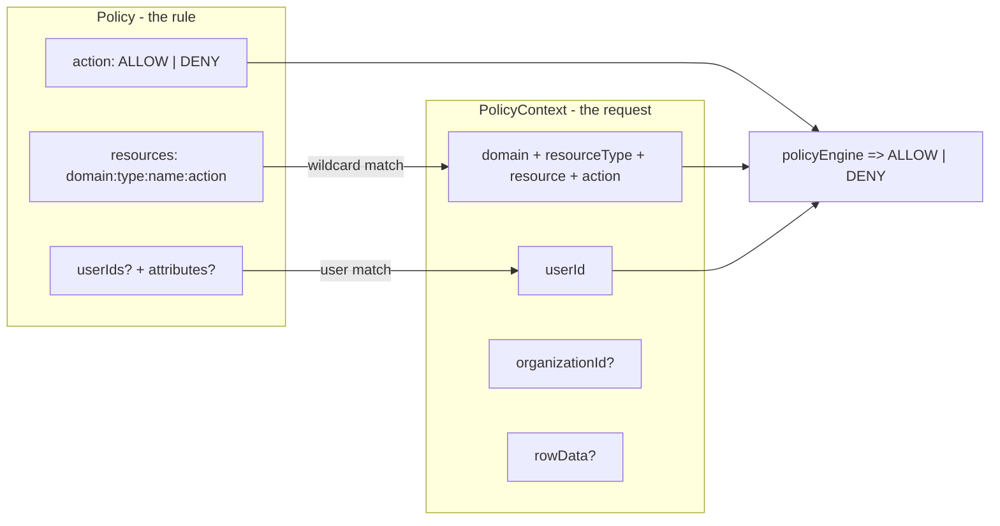
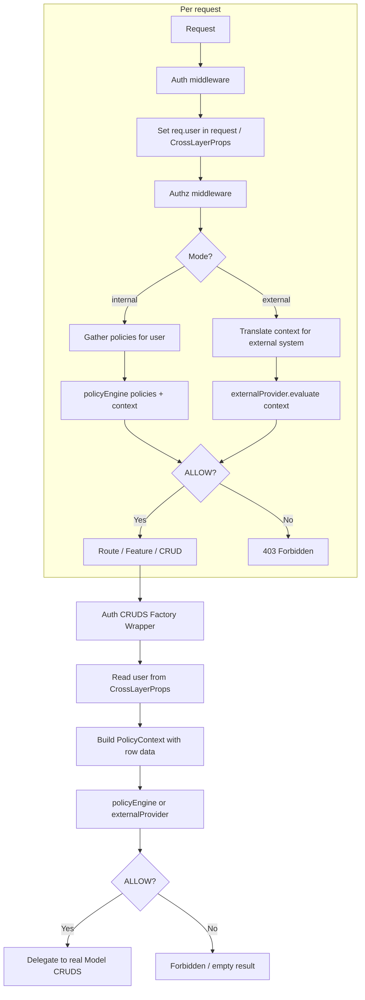
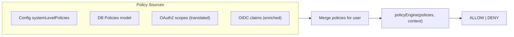
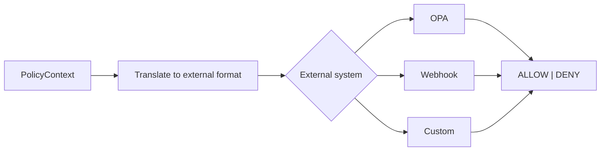

# Authorization Implementation Plan for @node-in-layers/auth

## Current state

- **Authentication** is implemented: login (Basic, API Key, OIDC), JWT + refresh, `authenticate()`, protected/unprotected routes for REST and MCP. Middleware sets `req.user` after validating the system JWT.
- **Policy model and type** exist in [auth/src/core/models/Policies.ts](auth/src/core/models/Policies.ts) and [auth/src/core/types.ts](auth/src/core/types.ts) (`Policy`, `PolicyAction`, `resources`, `attributes`, `organizationId`). No policy engine or enforcement yet.
- **README** ([auth/README.md](auth/README.md)) has unfinished design notes (lines 309-562). Resource string examples have stale attribute segments that need removing. Example has a typo: `"policies"` should be `"resources"`.
- **Data access**: [core/src/layers.ts](core/src/layers.ts) loads models via `modelFactory` and optional `customModelFactory`. The factory is a namespace whose services expose `getModelProps(context)` returning `{ Model, fetcher }`. [data/src/services.ts](data/src/services.ts) implements `getModelProps(context, datastoreName?, crossLayerProps?)` and returns the ORM's `Model` and `fetcher`. Model CRUDs are created in core from these models; rest-api registers them as routes.

---

## 1. Core mental model: two authorization modes

### Mode 1: "Use our authorization"

Policies live in YOUR system (config + DB). Org admins manage them. The policy engine evaluates them locally.

### Mode 2: "Use your own authorization"

No policies stored locally. The engine translates the policy context into the external system's format and asks THEM to decide. We provide mapping helpers so external concepts (scopes, claims, roles) can work with our system.

In both cases, the **policy engine** is the constant and the **policy context** (what's being attempted) has the same shape.

### The engine signature

```typescript
// Mode 1: internal -- engine receives policies and context, decides
policyEngine(userRelatedPolicies: Policy[], context: PolicyContext) => 'ALLOW' | 'DENY'

// Mode 2: external delegation -- engine translates context, asks external system
externalProvider.evaluate(context: PolicyContext) => 'ALLOW' | 'DENY'
```

### The policy context (the "request")

What's happening RIGHT NOW. Following industry standards (AWS IAM, OPA, Cedar, Zanzibar all use: who + what action + what resource + environmental context):

```typescript
type PolicyContext = {
  // WHAT is being accessed (decomposed resource string)
  domain: string
  resourceType: 'models' | 'features'
  resource: string // model plural name or feature name
  action: string // 'Create' | 'Retrieve' | 'Update' | 'Delete' | 'Search' | '*'

  // WHO is accessing
  userId: PrimaryKeyType

  // ORG context (if applicable -- needed for org-scoped resource checks)
  organizationId?: PrimaryKeyType

  // ROW-LEVEL context (if applicable -- for model row-level checks)
  rowData?: Record<string, any>

  // ENVIRONMENTAL context
  ip?: string
  requestId?: string
}
```

---

## 2. The Policy object (the "rule")

A Policy is a rule defined ahead of time. It answers two questions: **WHAT** can be accessed, and **WHO** does this rule apply to.

### 2.1 The Policy type (updated)

```typescript
type Policy = Readonly<{
  id: PrimaryKeyType
  name: string
  description?: string

  // SCOPE: system-level (null/undefined) or org-level
  organizationId?: PrimaryKeyType

  // VERDICT: what happens when this policy matches
  action: PolicyAction // 'ALLOW' | 'DENY'

  // WHAT: resource strings (4 segments only, wildcards allowed)
  resources: ReadonlyArray<string>

  // WHO (three mechanisms, all optional):

  // Specific users this policy targets directly
  userIds?: ReadonlyArray<PrimaryKeyType>

  // Attribute constraints (matched against user's OrganizationAttributes)
  // e.g. [{ role: 'Editor' }] means "user must have OrganizationAttribute key='role' value='Editor'"
  attributes?: ReadonlyArray<Record<string, string>>

  // If NEITHER userIds nor attributes is provided:
  //   -> policy applies to everyone in scope
  //   -> (all org members for org-level, all authenticated users for system-level)

  createdAt?: string
  updatedAt?: string
}>
```

### 2.2 "Who" evaluation logic

When the engine checks if a policy applies to the current user:

1. If `userIds` is provided and user's ID is in the list -> policy applies.
2. If `attributes` is provided and user has matching `OrganizationAttributes` for the relevant org -> policy applies.
3. If BOTH are provided -> policy applies if user matches EITHER (two ways to target, OR logic).
4. If NEITHER is provided -> policy applies to everyone in scope.

### 2.3 Resource strings (4 segments only)

The resource string answers "what resource" -- nothing else. No attribute/role segments.

**Format:** `{domain}:{resourceType}:{resource}:{action}`

All segments support `*` for wildcard.

**Examples:**

- `myDomain:features:myFeature:*` -- all actions on myFeature
- `myDomain:models:Transcriptions:Retrieve` -- retrieve on Transcriptions
- `*:models:*:Search` -- search on any model in any domain
- `*:*:*:*` -- everything (admin)

**Model actions enum:**

```typescript
enum ActionForPolicy {
  Create = 'Create',
  Retrieve = 'Retrieve',
  Update = 'Update',
  Delete = 'Delete',
  Search = 'Search',
  Execute = 'Execute',
}
```

### 2.4 Policy examples

```typescript
// "These 2 specific users are DENIED from deleting Transcriptions"
{
  name: 'Block Deleters',
  organizationId: 'org-abc',
  action: 'DENY',
  resources: ['myDomain:models:Transcriptions:Delete'],
  userIds: ['user-123', 'user-456'],
}

// "Anyone with role Editor in this org can read Transcriptions"
{
  name: 'Editor Read Access',
  organizationId: 'org-abc',
  action: 'ALLOW',
  resources: ['myDomain:models:Transcriptions:Retrieve', 'myDomain:models:Transcriptions:Search'],
  attributes: [{ role: 'Editor' }],
}

// "All org members can access all features"
{
  name: 'Org Full Feature Access',
  organizationId: 'org-abc',
  action: 'ALLOW',
  resources: ['myDomain:features:*:*'],
  // no userIds, no attributes -> all org members
}

// "System-wide: all authenticated users can read all models"
{
  name: 'Global Read',
  action: 'ALLOW',
  resources: ['*:models:*:Retrieve', '*:models:*:Search'],
  // no organizationId -> system-level
  // no userIds, no attributes -> all authenticated users
}
```

---

## 3. Policy engine internals (Mode 1)

### 3.1 Engine evaluation order

```
policyEngine(userRelatedPolicies, policyContext) => ALLOW | DENY
```

1. Is user a system admin (`OrganizationAdmins` with `organizationId == null`)? -> immediate ALLOW.
2. Is this an org-scoped resource? Is user an org admin for that org? -> immediate ALLOW.
3. Filter policies to those whose "who" matches the current user (using the logic from section 2.2).
4. Filter matched policies to those whose `resources` match the `PolicyContext` (using wildcard matching).
5. Any matched DENY? -> DENY.
6. Any matched ALLOW? -> ALLOW.
7. Default: DENY.

### 3.2 Deliverables

- Resource string parser/normalizer and wildcard matcher (`matchesResource(requested, policyResource)`).
- `policyEngine(policies, context)` function.
- Helpers: `isSystemAdmin(userId)`, `isOrgAdmin(userId, orgId)`, `getUserAttributes(userId, orgId)`.
- Policy loading from: (1) config `systemLevelPolicies`, (2) DB (Policies model), with caching.

---

## 4. Policy sources: where policies come from

The policy engine is always the same. What varies is how policies are gathered for a given user.

### 4.1 Internal policy sources (Mode 1)

- **Config `systemLevelPolicies`**: system-wide policies defined at startup. Always loaded.
- **DB (Policies model)**: system-level (no `organizationId`) and org-level policies. Loaded per request (or cached with TTL).
- **Both sources are merged** before being passed to the engine.

### 4.2 OAuth2 scope mapping (Mode 1 with external identity)

When a user logs in via OIDC, their token carries scopes. These are translated INTO Policy objects and fed to the engine alongside any internal policies.

**Bidirectional mapping:**

- `scope -> Policy` (inbound): external scopes arrive at login -> translated to ALLOW Policy objects -> engine evaluates alongside other policies.
- `Policy -> scope` (outbound): internal policies -> translated to scope strings -> useful for generating tokens for downstream systems or displaying permissions in UI.

**Convention-based mapping (zero config for common cases):**

Built-in conventions so most systems need NO explicit scope configuration:

- `read` -> `*:models:*:Retrieve`, `*:models:*:Search`
- `write` -> `*:models:*:Create`, `*:models:*:Update`, `*:models:*:Delete`
- `admin` -> `*:*:*:*`
- `{domain}:read` -> `{domain}:models:*:Retrieve`, `{domain}:models:*:Search`
- `{domain}:write` -> `{domain}:models:*:Create`, `{domain}:models:*:Update`, `{domain}:models:*:Delete`
- `{domain}:{model}:read` -> `{domain}:models:{model}:Retrieve`, `{domain}:models:{model}:Search`
- `{domain}:{model}:write` -> `{domain}:models:{model}:Create`, `{domain}:models:{model}:Update`, `{domain}:models:{model}:Delete`

**Override only for special cases:**

```typescript
authorization: {
  scopeOverrides: {
    'billing:readonly': ['billing:models:Invoices:Retrieve', 'billing:models:Invoices:Search'],
  }
}
```

**Two scope behaviors:**

- `scopeBehavior: 'ceiling'` (default): scopes limit what this TOKEN can do. Both scope-derived policies AND internal policies must allow. (Pure OAuth2 model.)
- `scopeBehavior: 'grant'`: scopes ARE the permissions. No internal policies needed. (For systems where the OIDC provider IS the authorization source.)

### 4.3 OIDC claim-to-attribute mapping

Beyond scopes, OIDC tokens carry claims (`roles: ["editor"]`, `org: "acme"`). These are mapped into `OrganizationAttributes` at login time, so the policy engine can use them for attribute-based checks. This is enrichment, not runtime authorization.

---

## 5. External delegation (Mode 2)

For systems like OPA, Keycloak Authorization Services, or custom webhook endpoints where someone wants to fully delegate the authorization DECISION.

### 5.1 How it works

- No policies stored locally.
- The engine translates the `PolicyContext` into the external system's format and sends it.
- External system returns ALLOW/DENY.
- We provide built-in translators for common systems.

### 5.2 Supported external systems

- **OPA**: translate `PolicyContext` -> OPA input JSON, POST to `{endpoint}/v1/data/{policyPath}`, read `result`.
- **Webhook (generic HTTP)**: POST `PolicyContext` as JSON to any URL, expect `{ decision: "ALLOW" | "DENY" }`.
- **Custom**: user provides a namespace string pointing to a service with an `evaluate(context: PolicyContext)` function.

### 5.3 Configuration

```typescript
{
  [AuthNamespace.Core]: {
    authorization: {
      // Mode 1: internal (default)
      mode: 'internal',

      // Mode 2: external delegation
      // mode: 'external',
      // externalProvider: 'opa' | 'webhook' | 'custom',
      // opa?: { endpoint: string, policyPath: string, headers?: Record<string, string> },
      // webhook?: { url: string, headers?: Record<string, string>, timeoutMs?: number },
      // custom?: { providerNamespace: string },

      // Scope handling (works with either mode)
      scopeBehavior?: 'ceiling' | 'grant',
      scopeOverrides?: Record<string, string[]>,

      // General options
      policyCacheTtlSeconds?: number,
      noUserBehavior?: 'deny' | 'allow-as-system',  // default: 'deny'
    }
  }
}
```

---

## 6. Where authorization is enforced

### 6.1 Feature access (transport layer)

- **When:** after auth middleware sets `req.user`, before the feature/route executes.
- **What:** build `PolicyContext` from the request (domain, feature name, action), gather user's policies, call engine.
- **Where:** authorization middleware in Express/MCP layers. Returns 403 if DENY.

### 6.2 Model and row-level access (auth CRUDS factory)

- **Goal:** enforce "can access this model" and "can access this row" without every feature calling the engine manually.
- **Mechanism:** `@node-in-layers/auth` exposes `authModelCrudsOverrides()`. The user sets `modelCrudsFactory: [...authModelCrudsOverrides()]` in the core configuration. This factory intercepts CRUD operations generated by the system.
- **Wrapped CRUDS** intercepts operations:
  - **retrieve(id)**: retrieve row, build `PolicyContext` (with `rowData`), check engine. If DENY, return undefined.
  - **search(query)**: run search, filter results by row-level policy. Or push down: add filter by allowed organizationIds.
  - **create(data)**: check `domain:models:ModelName:Create` + org-scoped write check. Then delegate.
  - **update/delete**: same (model action + row-level).
- **Current user via CrossLayerProps**: The model CRUDS functions accept `CrossLayerProps` as the last argument, which allows passing the user down from the transport layer (Express/MCP) through to the model functions. The CRUDS factory pulls the user and request context from these props to evaluate policies.

### 6.3 Org-scoped models

A model is "org-scoped" when it has an `organizationId` property (or is marked with `OrganizationReferenceProperty`). For org-scoped models:

- The auth adapter reads `organizationId` from the row data and includes it in `PolicyContext`.
- The engine checks if the user is allowed for that org (admin bypass, then DENY/ALLOW evaluation with attribute constraints).
- On search: filter results to only rows the user has access to.

### 6.4 Edge cases

- **No user (cron, internal calls):** configurable: `noUserBehavior: 'deny'` (default) or `'allow-as-system'`.
- **Performance:** cache policies per org with TTL. Avoid loading all policies per request.
- **Audit:** optional audit log for DENY (and optionally ALLOW).

---

## 7. Configuration surface ("stupid silly easy")

### Minimal setup (internal authorization, no scopes)

```typescript
{
  [AuthNamespace.Core]: {
    systemLevelPolicies: [
      { name: 'All Users Read', action: 'ALLOW', resources: ['*:models:*:Retrieve', '*:models:*:Search'] }
    ],
  },
  [CoreNamespace.root]: {
    modelFactory: '@node-in-layers/auth-data',  // enables model/row-level enforcement
  }
}
```

### With OAuth2 scopes (zero scope config needed)

```typescript
{
  [AuthNamespace.Core]: {
    authorization: {
      scopeBehavior: 'grant',  // scopes from OIDC token ARE the permissions
    },
  },
}
```

### Full external delegation (OPA)

```typescript
{
  [AuthNamespace.Core]: {
    authorization: {
      mode: 'external',
      externalProvider: 'opa',
      opa: { endpoint: 'http://localhost:8181', policyPath: 'authz/allow' },
    },
  },
}
```

---

## 8. Implementation priorities

- **P0: (COMPLETED) Policy type update** -- Add `userIds` field, clean up types.
- **P0: (COMPLETED) Resource string format + matcher + model actions enum** -- 4-segment strings only, wildcard matching.
- **P0: (COMPLETED) PolicyContext type + policyEngine function** -- Core evaluation logic (sections 2 and 3).
- **P0: (COMPLETED) Pluggable CRUDS factory in Core** -- `modelCrudsFactory` in config and passing `CrossLayerProps` into model cruds functions.
- **P1: Auth CRUDS factory implementation** -- `authModelCrudsOverrides()` enforcing model and row-level policies.
- **P1: Feature/route authorization middleware** -- Feature-level control in Express/MCP using `CrossLayerProps`.
- **P1: Policy loading from DB + cache** -- So org admins can manage policies via Policies model.
- **P2: OAuth2 scope conventions + scopeBehavior** -- Scope-to-policy and policy-to-scope mapping.
- **P2: OrganizationReferenceProperty / row-level convention** -- Mark org-scoped models.
- **P2: README updates** -- Remove stale attribute segments from resource strings, fix typos, document everything.
- **P3: OPA external provider** -- First external delegation target.
- **P3: Webhook external provider** -- Universal external integration.
- **P3: Custom external provider** -- User-provided evaluate function.
- **P3: OIDC claim-to-attribute mapping** -- Enrichment at login time.
- **P3: Audit logging for DENY** -- Operations and security.
- **P4: Policy -> Scope (outbound)** -- Generate scoped tokens from internal policies.
- **P4: Provider chain** -- Compose multiple sources/providers.

---

## 9. Diagrams

### Policy vs PolicyContext (rule vs request)



### Request flow with authorization



### Policy sources



### External delegation



---

## 10. Files to add or touch

- **Modify:** [auth/src/core/types.ts](auth/src/core/types.ts) -- add `userIds` to Policy type, add `PolicyContext` type, add `ModelActionForPolicy` enum.
- **New:** `auth/src/core/resource-strings.ts` -- 4-segment format parsing, normalization, wildcard matcher, scope conventions.
- **New:** `auth/src/core/policy-engine.ts` -- `policyEngine(policies, context)`, "who" matching logic, helpers (isSystemAdmin, isOrgAdmin, getUserAttributes).
- **New:** `auth/src/core/scope-mapper.ts` -- `scopesToPolicies(scopes, overrides?)`, `policiesToScopes(policies)`, convention logic.
- **New:** `auth/src/core/providers/` -- `opa.ts`, `webhook.ts`, `custom.ts` (P3: external delegation providers).
- **Modify:** `auth/src/api/services.ts` -- build `authModelCrudsOverrides` logic implementing row-level enforcement inside of the model CRUDS wrapper.
- **Modify:** `auth/src/api/express.ts`, `auth/src/api/mcp.ts` -- populate `CrossLayerProps` with user info in auth middleware, add authz middleware.
- **Modify:** [auth/src/types.ts](auth/src/types.ts) -- add `authorization` config block.
- **Modify:** [auth/src/core/models/Policies.ts](auth/src/core/models/Policies.ts) -- add `userIds` property to model.
- **Modify:** [auth/README.md](auth/README.md) -- remove stale 5/6-segment resource string examples, fix `"policies"` to `"resources"`, document resource format (4 segments only), Policy "who" mechanisms, modes, scopes, external delegation, config.
- **Config:** document `modelCrudsFactory: [...authModelCrudsOverrides()]` in the system config.
